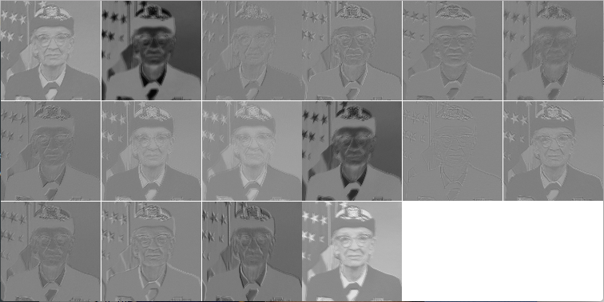

# Neural Nets on iOS

We only have an hour.

---

# We'll be using Torch

It's a lua based framework.

---

# Lua is fast

* It's easy to prototype with.
* very portable
* very fast
* very simple

---

# What is Torch then?

Torch is a scientific computing framework based on Lua[JIT] with strong CPU and CUDA backends.

https://github.com/torch/torch7/wiki/Cheatsheet

---

# What can torch do?

    th> t = torch.FloatTensor(5,5)
    [0.0001s]
    th> t
    0  0  0  0  0
    0  0  0  0  0
    0  0  0  0  0
    0  0  0  0  0
    0  0  0  0  0
    [torch.FloatTensor of size 5x5]

---

     th> t[1]
     0
     0
     0
     0
     0
     [torch.FloatTensor of size 5]

---

    th> t[1] = 100

    th> t
	100  100  100  100  100
    0    0    0    0    0
	0    0    0    0    0
	0    0    0    0    0
	0    0    0    0    0
	[torch.FloatTensor of size 5x5]

---

# Cheap Reshapes

```lua
th> t = torch.Tensor(5,3)
                                                                      [0.0001s]	
th> t = torch.Tensor(5,3):random(50)
                                                                      [0.0000s]	
th> t
 22   6  16
 14  24   2
 15  31  45
 40  22  15
 18  13  47
[torch.DoubleTensor of size 5x3]
```

---


```lua
th> t:reshape(15)
 22
  6
 16
 14
 24
  2
 15
 31
 45
 40
 22
 15
 18
 13
 47
[torch.DoubleTensor of size 15]

                                                                      [0.0036s]	
th> t:reshape(3,5)
 22   6  16  14  24
  2  15  31  45  40
 22  15  18  13  47
[torch.DoubleTensor of size 3x5]
```

---

# And Apply Functions to elements

```lua
th> t:apply(function(x)
..> return math.sin(x)
..> end)
-0.0089 -0.2794 -0.2879
 0.9906 -0.9056  0.9093
 0.6503 -0.4040  0.8509
 0.7451 -0.0089  0.6503
-0.7510  0.4202  0.1236
[torch.DoubleTensor of size 5x3]
```

---

# We can solve simultaneous equations

Consider:

```
 x + 4y = 11
3x - 5y = -1
```

---

```
/ 1  4\ / 11 \ 
\ 3 -5/ \ -1 /
```

---

```lua
th> a = torch.Tensor({{1, 4}, {3, -5}})
th> b = torch.Tensor({4, 6})
th> torch.inverse(a) * b
 3
 2
[torch.DoubleTensor of size 2]
```

---

# Tensors are the basic datastructure for torch

  - ByteTensor -- contains unsigned chars
  - CharTensor -- contains signed chars
  - ShortTensor -- contains shorts
  - IntTensor -- contains ints
  - LongTensor -- contains longs
  - FloatTensor -- contains floats
  - DoubleTensor -- contains doubles
  
---

```lua
th> t = torch.Tensor(5,5)
                                                                      [0.0001s]	
th> t:random(20)
 11  19  10   2  11
 20   8   2   8  11
  3   8   7  19   1
 18  10  18  11  20
 14  19  19  14   3
[torch.DoubleTensor of size 5x5]
```

---

```lua
th> t:sum()
286	
                                                                      [0.0001s]	
th> t:narrow(1,2,3)
 20   8   2   8  11
  3   8   7  19   1
 18  10  18  11  20
[torch.DoubleTensor of size 3x5]

```

---

```lua
                                                                      [0.0003s]	
th> t:narrow(1,2,3):fill(0)
 0  0  0  0  0
 0  0  0  0  0
 0  0  0  0  0
[torch.DoubleTensor of size 3x5]

                                                                      [0.0037s]	
th> t
 11  19  10   2  11
  0   0   0   0   0
  0   0   0   0   0
  0   0   0   0   0
 14  19  19  14   3
[torch.DoubleTensor of size 5x5]

                                                                      [0.0003s]	
```																	  

---

# There are some surprises

```lua
th> y = t
                                                                      [0.0001s]	
th> t
 11  19  10   2  11
  0   0   0   0   0
  0   0   0   0   0
  0   0   0   0   0
 14  19  19  14   3
[torch.DoubleTensor of size 5x5]

                                                                      [0.0003s]	
th> y
 11  19  10   2  11
  0   0   0   0   0
  0   0   0   0   0
  0   0   0   0   0
 14  19  19  14   3
[torch.DoubleTensor of size 5x5]
```

---

```lua
th> y:fill(1)
 1  1  1  1  1
 1  1  1  1  1
 1  1  1  1  1
 1  1  1  1  1
 1  1  1  1  1
[torch.DoubleTensor of size 5x5]

                                                                      [0.0003s]	
th> t
 1  1  1  1  1
 1  1  1  1  1
 1  1  1  1  1
 1  1  1  1  1
 1  1  1  1  1
[torch.DoubleTensor of size 5x5]

                                                                      [0.0003s]	
```

---

# Use clone

```lua
th> x = t:clone()
                                                                      [0.0001s]	
th> x
 1  1  1  1  1
 1  1  1  1  1
 1  1  1  1  1
 1  1  1  1  1
 1  1  1  1  1
[torch.DoubleTensor of size 5x5]
```

---

```lua
th> x:random(10)
  4   2   5   3   3
  6   9  10   7   3
  6   5  10   1   2
  4   9   8   6   9
  9   3   9  10   6
[torch.DoubleTensor of size 5x5]

                                                                      [0.0003s]	
th> t
 1  1  1  1  1
 1  1  1  1  1
 1  1  1  1  1
 1  1  1  1  1
 1  1  1  1  1
[torch.DoubleTensor of size 5x5]
```

---

# There are a lot of packages

nn is the name of the Neural Net package

---

# What is a Neural Net?

Neural Nets are a very old technology.  By old I mean they started out
in the 1940s.  But it wasn’t really until recently that they’ve been
popular because of the popularity of Deep Learning.

---

# They are Sometimes Call Perceptrons

---

# A simple Neuron


---

# And a Function

The Sigmoid.  We're not going to talk about this
a whole bunch.  (find IIT class in Neural Nets)

---

# Inputs and Outputs

Sound familiar?

---

# A single neuron is not important

---

# Layers and Layers

Things get interesting when we combine them
into layers.  But let's start simple.


---

# in Torch

we use `require 'nn'`

--- 

```lua
stoplight = nn.Sequential()
stoplight:add(nn.Linear(4,1))
```

---

# We're modeling stoplights

Two streets intersect,  It's only safe to cross any
one of these streets if all the lights are red.

---

```lua
lights = {
   torch.Tensor({0,0,0,0}),
   torch.Tensor({0,0,0,1}),
   torch.Tensor({0,0,1,0}),
   torch.Tensor({0,1,0,0}),
   torch.Tensor({1,0,0,0}),
   torch.Tensor({1,0,0,1}),
   torch.Tensor({0,1,1,0}),
   torch.Tensor({1,0,1,0}),
   torch.Tensor({0,1,0,1}),
   torch.Tensor({1,1,0,0}),
   torch.Tensor({0,0,1,1}),
   torch.Tensor({1,0,1,1}),
   torch.Tensor({1,1,0,1}),
   torch.Tensor({1,1,1,0}),
   torch.Tensor({1,1,1,1})
}
```

---

# We use that training data

Neural Nets Must Be Trainied

---

# We do that with a Criterion

```lua
criterion = nn.MSECriterion()
```

---

# The process is simple
## and repeated a bunch

  - Input the data
  - Feed it into the criterion
  - Zero out the gradients
  - back propogate the output (learning)
  - update the parameters with the learning rate
  
---

```lua
for i = 1,15 do

   input = torch.Tensor({lights[i][1], lights[i][2], lights[i][3], lights[i][4]})
   output = torch.Tensor({ 0 })
   
   -- the only safe one is the 15th
   if i == 15 then
      output = torch.Tensor({ 1 })
   end
   criterion:forward(stoplight:forward(input), output)
   
   -- train over this example in 3 steps
   -- (1) zero the accumulation of the gradients
   stoplight:zeroGradParameters()
   -- (2) accumulate gradients
   stoplight:backward(input, criterion:backward(stoplight.output, output))
   -- (3) update parameters with a 0.01 learning rate
   stoplight:updateParameters(0.1)
end
```

---

# We can save this

And load it. Training only happens once.

---

#  A more complicated example

Conways Game Of Life!

---

# Rules are simple

- If a living cell has two or three neighbors it survives
- If a dead cell has exactly three neighbors it becomes alive
- If a living cell has more than 3 neighborts it dies
- If a living cell has less than 2 neighborts it dies

---

# We can solve this the old fashioned way

---

# But let's make it Neural Nets!

---

```lua
conwaynn_simple = nn.Sequential()
conwaynn_simple:add(nn.Linear(9,1))
```

---

# That net isn't too good

The reason is because it doesn't have enough nodes/layers
to categorize the data.

It gets wrong answer a lot.  

---

# What if we made it more complicated?


```lua
conwaynn_reasonable = nn.Sequential()
conwaynn_reasonable:add(nn.Linear(9,3))
conwaynn_reasonable:add(nn.Sigmoid())
conwaynn_reasonable:add(nn.Linear(3,1))
```

---

# With enough training, that one is great

---

# What if we went even further?

```lua
conwaynn = nn.Sequential()
conwaynn:add(nn.Linear(9,3))
conwaynn:add(nn.Sigmoid())
conwaynn:add(nn.Linear(3,5))
conwaynn:add(nn.Tanh())
conwaynn:add(nn.Linear(5,1))
```

---

# which is better?

That's beyond the scope of our discussion

---

# Training takes a long time

To create and train each of these nets 
1000000 times took 228.9 (ish) seconds on
my Air.

And lots of cpu time.  It takes forever on a device.
Best to train on something beefy. With Cuda.

---

# We can save and load

```lua
torch.save('filename', neural_network)
neural_network = torch.load('filename')
```

It's cross platform.

---

# Why do we care?  Learning

These examples are here to help you understand how to
construct nets.  The real win of these things is that they
can 'learn'.

---

# Learning?

Yes, from existing data.  This is called
supervised learning. 

---

# You can't logic your way in data

Though when you do, it's called a heuristic.
Those can be helpful with training.

---

# OK,  what does all of this have to do with images?

I kinda buried the lead on this, maybe?

---

# Not Really

Images are super hard. 

---

# Consider our target Image


---

# Let's look at a convolution


```lua
n = nn.SpatialConvolution(1,16,12,12)

```

---

# Then Apply them

```lua
n:forward(image.rgb2y(i))
```



---

# We then use those as inputs

This is where Convolutional Neural Networks
come into play

---


[By Aphex34 - Own work, CC BY-SA 4.0](https://commons.wikimedia.org/w/index.php?curid=45679374)

---

# Some of these networks are HUGE

Both in terms of on-disk size and layers.

---

# You promised iOS?

And I haven't seen it yet.

---

# It's ObjC

Sorry

---

# Get the code

https://github.com/clementfarabet/torch-ios.git

---

# Build it

```sh
$ ./generate_ios_framework
```

Which generates `Torch.framework`

---

# Put that into your project

And import the class `Torch.m/.h`
As well as add `Torch.framework` and 
`Accelerate.framework` 

---

# Then Add all the lua files

Any lua files you add must be added as resources
so they get copied.

---

# And use 

```ObjC
@property (strong) Torch *t;


self.t = [[Torch alloc] init];
[self.t initialize];
[self.t runMain:@"main" inFolder:@"lua"];
[self.t loadFileWithName:@"FILEWITHSOMEDATA" inResourceFolder:@"lua" andLoadMethodName:@"loadNeuralNetwork"];
```

---

```lua
require 'torch'
model = ""

function loadNeuralNetwork(path)
  model = torch.load(path)
end

function classify(living, neighbor_count)
    print(living,neighbor_count)
    local input = torch.DoubleTensor(2)
    input[1] = living
    input[2] = neighbor_count
    local res = model:forward(input)
    if res[1] > 0.9 then
        print("alive")
        return 1
    else
        print("dead")
        return 0
    end
end
```
---

# Some Boilerplate

```ObjC
lua_State *L = [self.t getLuaState];

NSInteger garbage_size_kbytes = lua_gc(L, LUA_GCCOUNT, LUAT_STACK_INDEX_FLOAT_TENSORS);

if (garbage_size_kbytes >= 20000) // this is 20mb
{
        // we should never hit this, but with training and stuff like
        // that it's not a bad idea to gc once and a while
        lua_gc(L, LUA_GCCOLLECT, LUAT_STACK_INDEX_FLOAT_TENSORS);
}
```

---

# Calling lua from ObjC

```lua
int aliveOrDead = self.aliveOrDeadSegment.selectedSegmentIndex == 1 ? 1 : 0;
    int neighbors = (int)ceil(self.livingNeighborsSlider.value);
    lua_getglobal(L,"classify");
    lua_pushnumber(L,aliveOrDead);
    lua_pushnumber(L,neighbors);
```

---

# Get The Results

```ObjC
// two inputs one output
int res = lua_pcall(L, 2, 1, 0);
if (res != 0)
 {
   NSLog(@"error running function `f': %s",lua_tostring(L, -1));
 }

CGFloat returnValue = lua_tonumber(L, -1);
lua_pop(L, 1);  /* pop returned value */
```

---

# You can use C++, sortof

https://github.com/facebook/thpp

Please see the header file `<thpp/Tensor.h>` for more details.

---

# What about text?

Now that's where things get kindof interesting.

---

# Non NN but still torch

https://github.com/kemaswill/fasttext_torch

This Implements the 'Bag of Tricks' classifier from
https://arxiv.org/abs/1607.01759

---

# Bag Of Tricks for Efficient Text Classification

  ... Our experiments show that our fast text classifier fastText is often on par with deep learning classifiers in terms of accuracy, and many orders of magnitude faster for training and evaluation. We can train fastText on more than one billion words in less than ten minutes using a standard multicore CPU...

---

# Torch is a generic
## machine learning toolkit

---

# Where to go from here?

http://deeplearning.net/tutorial/logreg.html

and 

http://deeplearning.net/tutorial/mlp.html

---

# What did we learn

- How to install and use Torch
- even on iOS
- What CNNs are
- Why we care about Neural Nets at all


---

# Thanks

https://github.com/kognate/presentations/slides/nn/nn_ios.md


